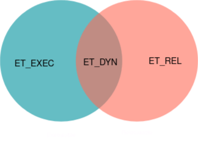

If you ask a population of programmers what the linker is, probably less than 50% will be able to tell you. And if you dare to question what it does, in reality I believe less than 5% knows precisely. Even though compilers are the center of attention in computer science, we use linkers just as much and they involve some interesting engineering. Executables and libraries are all carefully crafted products of the linker. Why can't I run a static library? And why can't I just use code from an executable as a library? What is discussed in this blog post is not usually something the programmer interacts with, but in this deeper dive to linkers and binary files we can obtain an understanding of what the linker does and it will answer a lot of the familiar behavior of typical binaries we programmers encounter daily.

## The processor's perspective
First, let's put ourselves in the shoes of a modern microprocessor. Processors, are a finite implementation of a the theoretic concept that inspired them,
the turing machine. That roughly makes them a machine that
reads symbols (instructions) from a tape (memory) and according those instructions and its internal state (registers), performs some changes in that memory.
More precisely, modern computers are random-access, stored program machines.
The instructions are given in some place (address [[2]](#notes)) in the computer's memory and the processor can (with adequate permission) read and modify the
contents of any address. One of the processor's registers, the program counter is responsible for containing the address of the instruction that will be executed next.

Here is an example of a typical function in a amd64 processor program (it doesn't matter what it does for this blog post).
```asm
/*39:   55*/                      push   %rbp
/*3a:   48 89 e5*/                mov    %rsp,%rbp
/*3d:   48 83 ec 08*/             sub    $0x8,%rsp
/*41:   89 7d fc*/                mov    %edi,-0x4(%rbp)
/*44:   8b 45 fc*/                mov    -0x4(%rbp),%eax
/*47:   83 e0 01*/                and    $0x1,%eax
/*4a:   85 c0*/                   test   %eax,%eax
/*4c:   75 0c*/                   jne    0x5a
/*4e:   8b 45 fc*/                mov    -0x4(%rbp),%eax
/*51:   89 c7*/                   mov    %eax,%edi
/*53:   e8 00 00 00 00*/          call   0x24
/*58:   eb 0a*/                   jmp    0x64
/*5a:   8b 45 fc*/                mov    -0x4(%rbp),%eax
/*5d:   89 c7*/                   mov    %eax,%edi
/*5f:   e8 00 00 00 00*/          call   0xf
/*64:   c9*/                      leave
/*65:   c3*/                      ret
```
In the comments to the left I am showing the address of the instruction in memory and at the hex values of the instruction itself. To the right I'm using a roughly 1-1
textual representation of the instructions (assembly) so that the program is human readable.
In order to execute that program, we can set the processor's program counter to the program's start and let it do its thing.
The processor will happily follow any instructions it reads, performing some operation with its registers and increment its program counter.
Potentially, it can "jump" its program counter to some other address and continue execution there,
as do the instructions `jne`, `call` or `jmp`.

All that is to say that processors generally speaking do some of the following things, according to their instructions:
1. Read a value from memory onto some of its registers
2. Perform some operation that modifies the register contents [[3]](#notes)
3. Store register contents into memory
4. Jump execution to another address

Let's think of a file format that would be convenient for containing the information of an executable program.
At the bare minimum, we would want to include the program binary segments (code and data), along with some information about each segment such as
which address it should be loaded to and what the permissions (read write execute) of each segment are, so we can avoid basic program bugs
and malicious code that tries to execute data. So a "segment header" that contains the placement of each segment in the file
as well as metadata such as its size, load address and permissions would be enough so that a program loader can run our code [[4]](#notes).

Now let's see things from a different perspective.

## The programer's perspective
Humans build things. They create physics simulators, graphics engines, websites, robots and neural networks.
We modularise logic into reusable pieces, share and distribute them. When creating games, we want to use a plethora of software components
including a physics engine, a 2D and 3D graphics library, a realtime 3D sound library and perhaps networking. All of these components require months of
dedicated work of experts and without a binary library system in place the current capabilities of software developers would be completely different
to what we have now.

One approach is to share the source code, but often times efficient compilation of the code itself is not simple and sometimes proprietary compilers are used.
More often the source code itself is proprietary and not made available. Besides, on large codebases having to compile everything on every new project is a huge
waste of time. We want to be able to share and reuse the binary code itself.

We can start imagining how we would share and reuse the previous code in the format
we came up with earlier, but we immediately run into problems. In order to call that function, we would need to know its corresponding address.
Okay, this is already cumbersome but not infeasible. Even worse though, our final binary would have to have multiple code and data sections, one set for each
compiled library and we would have to somehow ensure that the addresses of each function does not clash, which is unmanageable in practise.
What we would really want, is to be able to *relocate* all functions and data together into a new, unified address space.

At first you might think this is simple. You just adjust each program references to the target's new location and it should work. For example,
in the previous code sample, if the `call` target moves from address `0x24` to `0x44`, you add `0x20` to the `call`'s argument
and it will jump to the correct target. But what if we have the following piece of code:

`auto y = myfunction;        // mov     QWORD PTR [rbp-8], 0x4000`

How would we know if this piece of code is a reference after it is compiled? It might jump excecution to that address later in the function or it might just pass
it to another function. For all we know, the code could have been just manipulating the literal value `0x4000`.
**For compiled binaries, it is impossible to tell which number is a program reference or a literal value in the general case**.
Obviously, programmers know that we aren't dealing with any of these problems today, we just call whatever library function we want by name,
every reference gets shifted correctly and everthing just works, abstracted away from us by the compiler (more accurately by the linker it calls).
In other words, we want to make our binary format *relocatable*, and the way binary libraries achieve this is with two key pieces of information:
the symbol table and the relocation table.

## Shaping a relocatable format
First, we should supplement our binary format with information about the names of each symbol so we can call/reference each symbol by name and not address.
In ELF terms, a section called `.symtab` is added, which among other things contains the position of each symbol in our binary and an offset to its null-terminated
name in another section called the "symbol string table". With this simple addition we can call functions from a library by name as we are used to, but our
binary is still not relocatable.

Since it's not possible to determine what values are program references or not, the compiler has to step in and add a section with that information.
In the ELF format, this is taken care of by the relocation section(s) (usually `.rel` or `.rela`). When generating a relocatable binary, for each reference the compiler runs into,
it adds a *relocation entry* to a relocation section that contains 
1. the symbol that is referenced
2. the location of the reference
3. the exact guidelines on how to patch the code at that location if eventually the symbol address is known

We can finally arrive at an accurate definition on what a linker is:

> A linker is a program that converts a relocatable (or linkable) file into an executable file. It does two things, resolve symbol references by symbol name
and performs all patches according to the relocation section(s).

In reality the compiler always outputs a relocatable file and then the linker is responsible for "packaging" it into an executable or library.

## The ELF file format and the different binary types
We now have two competing concepts of a binary, a linkable format that is able to be relocated and an excecutable format that we can run.
The former can be used as a *library*, which is piece of code that can be reused in any executable program that wants it.

The ELF binary format defines 4 standardized object file types. One of them is `ET_CORE` core files, which are just wrappers
of memory dumps of processes useful for debugging.
The rest of the types are the ones that programmers interact daily and are manipulated by the linker. Let's place them on a venn diagram



1. Relocatable files (`ET_REL`). These give ELF the linkable part of its name. As the name describes, these file are analogous to binaries we described in the previous section, and are able to be shifted around. They don't necessarily have enough information to run them as is, as it is usually not defined how these files are supposed
to be placed in an address space and their cross references are not yet tied up. They are perfect for *static libraries*, which on linux is basically an archive of a bunch of these files.
2. Executable files (`ET_EXEC`). These are at the opposite spectrum of relocatable files. They have hardcoded addresses as references and are ready to be put in an address space and eaten by the processor.
3. Shared object files (`ET_DYN`). They can sort of play both roles. They are relocatable meaning that their references can be shifted, but they also define information that allows them to be linked at runtime to create a process image. I should maybe follow up with a separate blog post for dynamic or runtime linking, but I'll skip it for now for simplicity. It doesn't interfere from understanding anything explained here.

We can now map our familiar binary formats to what they represent in ELF terms.

- `.o` object files are ELF relocatable files (`ET_REL`). They are fresh out of the compiler output and can be used to create any type of library or executable
- `.a` static library files. These are actually not ELF files but an archive of `.o` object files created by the `ar` utility. This collection of code is what we call a library and it can be further linked with other code to form executables
- `.so` shared object files. These are ELF shared objects (`ET_DYN`), a special linked collection of `.o` files that can be further linked at runtime to a running process.
- Regular executable files. The files you execute can be either ELF executable of shared object files [[5]](#notes)

And with that we have derived the familiar landscape of binaries in linux!

## Afterword
Hopefully this blog post made you appreciate the engineering of binary formats and linking a little bit more. I hope it also gave you the bigger picture that will help you read any ELF, ABI, linker or low level manuals you read in the future. Thank you for reading!!

## Notes
[1] The notion of relocatability used thoughout this post is akin to position-independence used in different contexts.

[2] In reality, using a common address space in real computers is very impractical. Programs intended to be running at the same time as other processes
would need to be aware of all regions that are in potential use by every other process so they do not mistakenly interfere with them.
In reality, processors incorporate an extra abstraction called *address translation*, which translates *virtual addresses* referenced by the program, into some physical address that the operated system chose carefully to avoid any interference. With that convenient abstraction, programs can be all compiled to the same virtual address space with no real overlap.

[3] Steps 1 and 2 are often combined into one in load-memory architectures (e.g. amd64), while they are always distinct steps in load-store architectures (e.g. ARM)

[4] In many cases binary representations can go even simpler than that.
Microcontrollers only run a single program so they already know at which memory region the program is going to be loaded to.
They also don't have the operating system abstraction so no one enforces program permissions (the code runs at "ring-0").
In fact those processors usually just use the raw program data as is! `objcopy -O binary code.elf finalbin.bin` is how the file to be flashed is obtained

[5] In reality, the vast majority of linux executables are ELF shared objects. This is done so that executables can be moved around the address space, as far as I know for security reasons (see Address Space Layout Randomization)