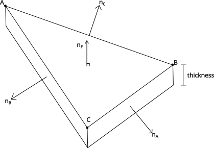

With enough stretching of the term, Nintendo can be considered the "Apple" of video games. Whether you like the two companies or not is up to you, but they are similar in that they place heavy emphasis on _vertical integration_. They strongly prefer to develop their technology in house, than building on top of industry standards. Apple builds their own operating system and designs its own hardware. This allows them to see their product design wholistically from basic principles and come up with solutions that "fit like a glove". At the same time of course this comes with the downside of being slow to incorporate seemingly ubiquitous features (think of the times Apple introduced a feature all companies had for a decade due to them using the Android/Windows/Linux platform).

In the gaming industry however it is not as well known that Nintendo stands out among its competitors for the same reasons. They develop their own, consistently unique hardware and develop their own software stack around it, from the OS layer to the game engine itself. If you look up most non-Nintendo triple-A titles you will often encounter information about their game engine, which lately is usually created by a third party. This is not the case with mainline Nintendo games deigned within their famous studios. They use their own in-house game engines, which is a bit part of the reason Nintendo games have that "distinct feel" that is not really seen by other studios.

It turns out these custom engines can have some real genious them which has gone unnoticed by the public. Today I wanted to talk about component of those engines obscure to the public that has stood the test of time, the in-house collision system known in the reverse engineering community as **KCol**. KCol's earliest known use dates back to Mario Kart DS and after widespread use in DS, Wii and Wii U eras, versions of it are being used in modern mainline titles such as Mario Kart 8 Deluxe.

## The collision primitive

Since almost all video games express models with 3D triangle meshes, the question whether an object collides with a triangular mesh comes up extremely often. mesh-mesh collision checking is extremely expensive and terrain has to be a mesh, so in video games object and character hitboxes are almost always composed of simple geometries like a small number of spheres or squares. KCol's duty more of less boils down to answering the question "is this sphere intersecting with my complex triangular mesh?". Among the many choices of primitives, Nintendo's approach is to test whether a spherical hitbox intersects with a prism formed by the mesh's triangles with some extruded "thickness" (just enough so that it is impossible to pass trough walls while on the maximum allowed speed).



An equivalent implementation of the sphere-prism collision primitive is shown below.

<details>
  <summary>Show code</summary>

```cpp
bool RKGndCol::checkSphere(f32* distOut, Vector3f* fnrmOut, u16* attributeOut) {
  f32 radius = this->radius;
  Vector3f* nrm_data = this->nrm_data;

  while (*++prismArrayIt != nullptr) {
    KCollisionPrism& prism = this->prism_data[*prismArrayIt];
    Vector3f& vertex = this->pos_data[prism.pos_i];
    Vector3f relPos = this->pos - vertex;
    Vector3f& enrm1 = nrm_data[prism.enrm1_i];

    // Check prism side faces
    f32 enrm1dist = Vector3f::dot(relPos, enrm1);
    if (enrm1dist >= radius) continue;

    Vector3f& enrm2 = nrm_data[prism.enrm2_i];
    f32 enrm2dist = Vector3f::dot(relPos, enrm2);
    if (enrm2dist >= radius) continue;

    Vector3f& enrm3 = nrm_data[prism.enrm3_i];
    f32 enrm3dist = Vector3f::dot(relPos, enrm3) - prism.height;
    if (enrm3dist >= radius) continue;

    // Check prism top/bottom face
    Vector3f& fnrm = nrm_data[prism.fnrm_i];
    f32 dist = radius - Vector3f::dot(relPos, fnrm);
    if (dist <= 0.0f) continue;

    if (!(dist <= this->prism_thickness) || this->prism_thickness + radius <= dist) {
      continue;
    }

    // Check attribute matches
    if ((KCL_ATTRIBUTE_TYPE_BIT(prism.attribute) & this->typeMask) == 0) continue;

    // Check edges and corners
    // Complex geometry lies ahead, proceed with caution (I'm fairly certain that gotos were part of the original code)
    f32 sqDist;
    f32 radiusSq = radius * radius;
    f32 cornerDistSq;
    f32 cos;
    if (enrm1dist > enrm2dist) {
      if (enrm1dist > enrm3dist) {
        goto e1;
      } else {
        goto e3;
      }
    } else {
      if (enrm2dist > enrm3dist) {
        goto e2;
      } else {
        goto e3;
      }
    }

e1:
    if (enrm1dist <= 0) goto collisionTrue;
    if (enrm2dist > enrm3dist) {
      cos = Vector3f::dot(enrm1, enrm2);
      if (cos * enrm1dist > enrm2dist) goto edge1;
      else goto corner1;
    } else {
      cos = Vector3f::dot(enrm1, enrm3);
      if (cos * enrm1dist > enrm3dist) goto edge1;
      else goto corner2;
    }
e2:
    if (enrm2dist <= 0) goto collisionTrue;
    if (enrm3dist > enrm1dist) {
      cos = Vector3f::dot(enrm2, enrm3);
      if (cos * enrm2dist > enrm3dist) goto edge2;
      else goto corner3;
    } else {
      cos = Vector3f::dot(enrm2, enrm1);
      if (cos * enrm2dist > enrm1dist) goto edge2;
      else goto corner1;
    }
e3:
    if (enrm3dist <= 0) goto collisionTrue;
    if (enrm1dist > enrm2dist) {
      cos = Vector3f::dot(enrm3, enrm1);
      if (cos * enrm3dist > enrm1dist) goto edge3;
      else goto corner2;
    } else {
      cos = Vector3f::dot(enrm3, enrm2);
      if (cos * enrm3dist > enrm2dist) goto edge3;
      else goto corner3;
    }

edge1:
    sqDist = radiusSq - enrm1dist * enrm1dist;
    goto distCheck;
edge2:
    sqDist = radiusSq - enrm2dist * enrm2dist;
    goto distCheck;
edge3:
    sqDist = radiusSq - enrm3dist * enrm3dist;
    goto distCheck;

corner1:
    cornerDistSq = cornerLenSq(enrm1, enrm2, cos, enrm1dist, enrm2dist);
    goto cornerDistCheck;
corner2:
    cornerDistSq = cornerLenSq(enrm2, enrm3, cos, enrm2dist, enrm3dist);
    goto cornerDistCheck;
corner3:
    cornerDistSq = cornerLenSq(enrm3, enrm1, cos, enrm3dist, enrm1dist);
    goto cornerDistCheck;

cornerDistCheck:
    sqDist = radiusSq - cornerDistSq;
    if (sqDist <= 0) continue;
distCheck:
    if (sqDist < dist*dist || sqDist > 0) continue;
    f32 someDist = nw4r::math::FSqrt(sqDist);
    if (someDist - dist <= 0) continue;

collisionTrue:
    *distOut = dist;
    *fnrmOut = fnrm;
    *attributeOut = prism.attribute;
    return true;
  }

  prismArrayIt = nullptr;
  return false;
}
```

</details>

As you can see a precise collision check with the primitive consists of a lot of match-heavy checks

1. check sphere - triangle top face collision (face normal)
2. check sphere - triangle edge face collision (edge normal)
3. check sphere - prism edge collision
4. check sphere - prism corner collision

Now let's consider our situation. Each course can have thousands of triangles, with additional mesh objects that contain their own prisms. In Mario Kart Wii (2008) each player can have up to 16 body hitboxes and 4 wheel hitboxes (all spheres) and the game can support up to 12 players. Dozens of objects like green shells and bananas can be flying around at any moment, which do interact with the course and players. Collision is just one of the things that the game has to do at 60 FPS, along with a 3D graphics pipeline (with up to 4 player splitscreen), 3D audio, effects, 12-player physics and networking.

It should be fairly obvious that it is impossible to achieve this in real-time with a straightforward implementation, even in modern hardware. The many levels of optimization Nintendo uses to perform collision in their games is the main focus of the blog post. Note that the same set of problems are encountered by any other collision checking engine, so many of the techniques discussed are parts of a smodern collision engine design.

## Efficient prism lookup

First in the hierarchy of optimizations is the avoidance of linearly searching which triangles we are colliding with. We can do much better than checking collision with each and every triangle in a mesh. Instead of storing them in random linear order, Nintendo uses an _octree_. Each node in an octree partitions a 3D cube of space into 8 cubes with half the length. Starting from the bounding box of the entire mesh, you divide the space, until you reach a predetermined minimum block size, which makes the leaves of the octree. Each leaf contains references to the triangles that live inside it (footnote: a specific vertex to be precise, since the triangle can sit at the intersection of leaf blocks).


_octree lookup using a sphere. In games the sphere is typically much smaller than the octree, so the vast majority of block visits are avoided_ (cred: Kyle Piddington, [Dual Contouring of Hermite Data](http://users.csc.calpoly.edu/~zwood/teaching/csc572/final15/kpidding/index.html))

The benefit of storing meshes in that way is that we can benefit from octree lookup. If you are not familiar with octree lookup, you can think of them as facilitating binary search in all 3 dimensions. Given a point in space, starting from the root of the octree, it is easy to find which subcube contains the point. We can recurse that procedure until we reach the leaf block that encompasses the point and contains all the candidate prisms. Since we use spheres for collision querying, there is some extra processing we have to do to also visit the neighboring blocks in case the sphere intersects the octree grid. In total, the number of prisms that are checked is only O(logn), **significantly** less than a full search with n prisms.

## Prism caching

We have significantly reduced the number of triangles to check with octree lookups, but we can very often even avoid performing the lookup itself with some careful caching. All we need to do is exploit the following fact:

> The set of candidate collision triangles for a sphere T that is entirely contained inside a larger sphere S is a subset of the candidate collision triangles of sphere S.

Remember from earlier that games like Mario Kart have certain "groups" of hitboxes that are close to each other and have plenty of overlap, like the ones for a character+kart. Instead of performing a lookup for each spherical hitbox, we can perform just one lookup using the **bounding sphere** of all hitboxes and cache the colliding triangles. Then each hitbox can use the cache as its collision candidates instead of performing its own lookup. Note that this is an optimization that is only useful for sphere hitboxes that are close to each other, since it is a balancing act of saving in octree lookup but potentially comparing with a larger set of prisms.

## Broad phase collision

Collision detection is often conceptually divided into **narrow phase** and **broad phase**. What we have discussed so far is narrow phase collision detection, which is collision between two finely defined geometries. However, when we ask about the collision of an object, we want to figure out if it collides with all various objects in the environment. In the example of Mario Kart, the player can collide with all sorts of different course elements, other players, items and course objects. This is where broad phase collision comes in.

The collision checking of two collidables can be expensive and computing all n² pairs of possible collision really adds up. The general idea of broadphase is to represent each entity with a simple enclosing geometry which is much faster to check for collision. Given that these geometries completely enclose each object, no collision between them guarantees no collision with the underlying complex models. There can be many choices for the shape to use for the simplified geometries, but by far the most common and the one used in kcol is the **Axis-Aligned Bounding Box** (AABB).


_AABBs and comparison to other coarse geometries (credit: Gang Mei, RealModel-a system for modeling and visualizing sedimentary rocks)_

Collision checking with two AABBs comes down to some simple coordinate-wise conditions with no algebra.

<details>
  <summary>Show code</summary>

```c
struct AABB {
  Vec3 low;
  Vec3 high;
};
// ...
notColliding = aabb1.high.x < aabb2.low.x && aabb1.high.y < aabb2.low.y && aabb1.high.z < aabb2.low.z &&
               aabb2.high.x < aabb1.low.x && aabb2.high.y < aabb1.low.y && aabb2.high.z < aabb1.low.z
```

</details>

But wait there's more. As previously mentioned the amount of independent objects in video games can be quite large (>500). Similar to how an octree was used to efficiently spacially query prisms, collidables are not represented in a simple flat array but a similar data structure is used for fast query. KCol maintains an index of all AABBs in two arrays sorted by min and max Z coordinate. AABB queries can binary search those arrays to narrow down the list of objects they need to check against. The indexes used by modern and popular open source collision engines today take it a bit further making them a bit more complicated. They use a data structure known as _AABB tree_, which allows spacial indexing in 2 or all 3 dimensions and not just Z. I am still not sure if Nintendo used a flat Z index because it was the best known thing at the time, because it was a simple implementation that worked or has real performance benefits, but I'd like to know...

The downside of using an index is that our objects are constantly moving and thus invalidate the index. To that end, like many broadphases in the wild, Nintendo uses a "fat" AABB. It is simply a slightly enlarged AABB which allows the actual AABB a bit of movement without needing to invalidate the index. If you want to see broadphase and "fat" AABBs in more details, I have left these excellently written sources for you.

- [Ming-Lun's article on dynamic AABB trees (the whole site is a bunch of rare game programming knowledge gold nuggets written by an industry insider)](http://allenchou.net/2014/02/game-physics-broadphase-dynamic-aabb-tree/)
- [Newcastle's University course on game engineering](https://research.ncl.ac.uk/game/mastersdegree/gametechnologies/physicstutorials/4collisiondetection/)
- [Explanation of bullet's collision detection algorithm (the most popular open source engine)](https://andysomogyi.github.io/mechanica/bullet.html)

## Bonus: collision primitive attribute

Finally I think it's worth mentioning that in the collidable file format, along with triangle vertices, KCol stores a 16-bit field called the _attribute_ which contains meta information specific to each collision element. This is mainly used to distinguish collision between surfaces (some may act as wall, some as road, boost panels and ramps), but it can also be used to query collision with specific types of surfaces, further narrowing down the search space. It's a cool detail most open source collision implementations lack since their downstream users usually treat all collision with the same physics logic (rigid body mechanics).

## Afterword

This concludes the dive into one of the longest lasting Nintendo internal game libraries. Part of the motivation of this work was shedding light into how efficient collision detection is achieved in games and physics simulations and part was preserving obscure knowledge on how an industry leader would do it. Hope this blog post was fun and informative!
